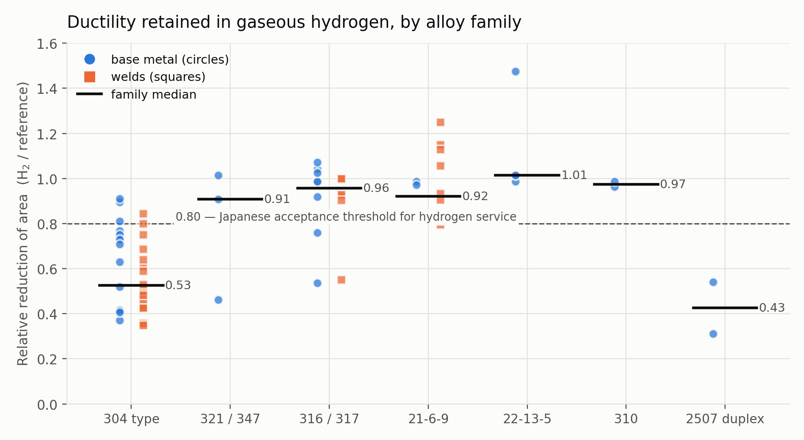
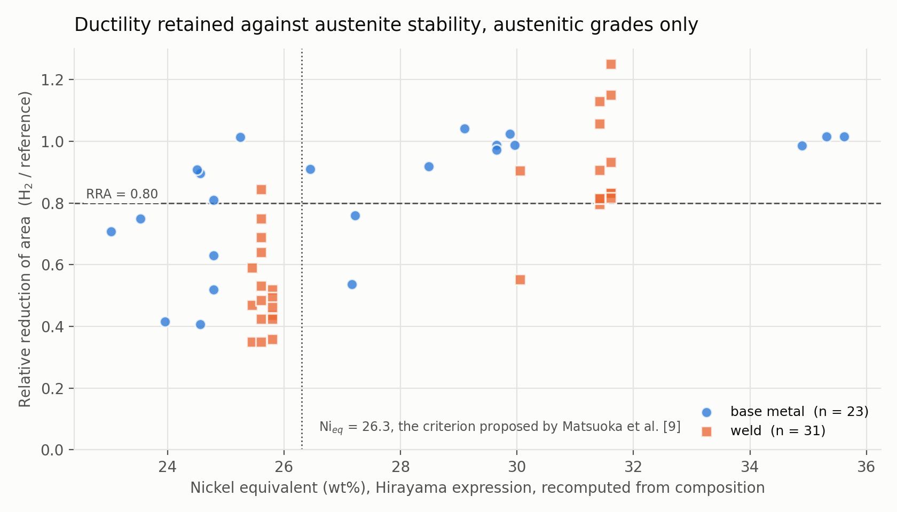

# HE-Austenite

An open dataset of hydrogen embrittlement in austenitic stainless steels tested in **hydrogen gas**, with the weld zone recorded for every row.

**Version 0.3** · 113 records · 45 fields · 9 sources, 1983–2024 · Data CC BY 4.0 · Code MIT

v0.3 corrects two errors found in the first deposit of v0.2 and keeps everything that version added: per-heat composition, a nickel equivalent recomputed on one expression for every record, and Md30. See [Changes](#changes).

**On the numbering.** An untagged snapshot of this repository was downloadable from 23 September 2026 and has been used in at least one external analysis, where it is cited as v0.1. It carried no composition data. v0.2 was the first archived release, deposited on 2 October 2026, and v0.3 supersedes it. Cite a release by its DOI and its version together.

Values were extracted by hand from published tables. No new experiments were performed, and no source document is redistributed here.

## Objective of the Dataset

Hydrogen infrastructure is welded. Refuelling stations run at 70 MPa, storage vessels and tube trailers are welded assemblies, and repurposing existing pipe networks depends on how the joints behave rather than the plate.

A weld is a casting sitting inside a wrought product. Its structure is dendritic, its composition differs from the parent metal, and austenitic stainless weld metal deliberately retains a few percent of delta ferrite to avoid solidification cracking. The weld is therefore the part of a joint least like the material a designer looked up, and the part hydrogen reaches first.

Most published embrittlement data covers base metal, and most recent weld studies charge specimens electrochemically, which cannot be converted to an equivalent gas pressure without assumptions about charging efficiency. This dataset keeps only gaseous exposure and records the weld zone for every row.

## What the data shows

Relative reduction of area (RRA) is the reduction of area measured in or after hydrogen divided by the value in the reference environment. A value of 1.0 means no measurable loss. Japanese regulatory practice accepts austenitic stainless steels for hydrogen service at RRA ≥ 0.80.

Zone and alloy family are **not independent** in this dataset, so they have to be read together. The table below is the honest form of the comparison — each cell gives the number of records and their median RRA.

| Alloy family | Base metal | Whole welded joint | Weld metal | All |
|---|---|---|---|---|
| Type 304 family | 14 / 0.72 | 8 / 0.59 | 12 / 0.48 | 34 / 0.53 |
| Types 316 and 317 | 8 / 0.99 | 4 / 0.96 | 2 / 0.73 | 14 / 0.96 |
| Types 321 and 347 | 3 / 0.91 | — | — | 3 / 0.91 |
| 21-6-9 | 2 / 0.98 | 12 / 0.87 | — | 14 / 0.92 |
| 22-13-5 | 4 / 1.01 | — | — | 4 / 1.01 |
| Type 310 | 2 / 0.97 | — | — | 2 / 0.97 |
| Duplex 2507 | 2 / 0.43 | — | — | 2 / 0.43 |
| A286 | 1 / 0.51 | — | — | 1 / 0.51 |
| **All families** | **36 / 0.85** | **24 / 0.83** | **14 / 0.49** | **74 / 0.80** |

The bottom row — base metal 0.85 against weld metal 0.49 — looks like a large weld penalty, but the two groups are not comparable head to head. The 14 weld-metal records come from three sources and 12 of them are type 304 family, while the 36 base-metal records span eight families and include the more stable grades. The within-family rows are where the zone effect can actually be read: 0.72 against 0.48 in the type 304 family, and 0.99 against 0.73 in types 316 and 317, on two weld records.



The alloy family ordering follows austenite stability. Type 310 and the nitrogen-strengthened grades 21-6-9 and 22-13-5 hold their ductility; the type 304 family, whose austenite transforms under strain, does not.

### Composition, and what it accounts for

v0.3 carries the composition each source published for the heat, weld deposit or filler that was tested, so austenite stability can be read from the data rather than asserted. The nickel equivalent is recomputed for every record from one expression, Hirayama's six-element form:

`Ni_eq = Ni + 0.65 Cr + 0.98 Mo + 1.05 Mn + 0.35 Si + 12.6 C`

The analysis below uses the 54 reduction-of-area records that carry a composition, excluding A286 as precipitation-strengthened and excluding `SAND2012-ch2101-T3111-5`, which reports the same measurement as a Caskey record already in the set. Those 54 records come from **24 distinct heats, weld deposits or fillers**, so the statistics below are quoted per material, not per record: eight of the Sandia composite weld rows share one fusion-zone analysis, and counting them as eight independent observations would overstate the evidence several times over.

Ductility retained rises with the nickel equivalent: Spearman ρ = 0.60 across the 24 materials (p = 0.002). Matsuoka et al. propose Ni_eq ≥ 26.3 as a selection criterion for hydrogen service, and that line separates this dataset:

| Ni_eq | materials | median RRA | records | median RRA | at RRA ≥ 0.80 |
|---|---|---|---|---|---|
| below 26.3 | 10 | 0.64 | 27 | 0.52 | 19% of records |
| 26.3 and above | 14 | 0.95 | 27 | 0.93 | 85% of records |



**What this does and does not show.** The variation is *between* alloy families, not within one. The low band is 26 of 27 records from the type 304 family; the high band is types 316/317, 21-6-9 and 22-13-5. Restricted to the type 304 family alone, where nine materials span Ni_eq 23.0 to 26.5, the relationship disappears (ρ = −0.12, p = 0.77). So in this dataset the nickel equivalent is close to a restatement of alloy family, and it should not be read as a predictor that resolves differences between heats of the same grade. The result is not an artefact of the mixed reference environments: restricting to air and helium references, which drops the twelve records referenced against the uncharged condition, leaves ρ = 0.63 across 18 materials (p = 0.005).

**Md30 does not survive the same test.** Angel's expression is fitted on 300-series compositions; applied to the manganese- and nitrogen-strengthened grades it returns temperatures below absolute zero, so it is computed only inside its fitted range (55 records). Within that range it carries no relationship with ductility retained here: ρ = −0.43 across 14 materials, p = 0.12. The strong-looking correlation that appears when the expression is extrapolated to 21-6-9 and 22-13-5 is an artefact of the extrapolation and is not reported.

The weld penalty is not simply a composition effect, but the evidence for that is thin:

| Ni_eq | zone | materials | records | median RRA |
|---|---|---|---|---|
| below 26.3 | base metal | 7 | 10 | 0.71 |
| below 26.3 | weld | 3 | 17 | 0.47 |
| 26.3 and above | base metal | 11 | 13 | 0.99 |
| 26.3 and above | weld | 3 | 14 | 0.86 |

Welds sit below base metal inside both bands, which argues that the zone effect is not only the 308L filler pulling the fusion zone's nickel equivalent below the parent plate. But each weld cell rests on **three** weld deposits, so this is a direction worth testing, not a quantity worth citing.

### On delta ferrite

Nakamura et al. (2018) tested one TIG-welded bar three ways at 228 K (−45 °C) in 106 MPa hydrogen against a nitrogen reference:

| Condition | RRA |
|---|---|
| 316 hi-Ni base metal | 1.02 |
| 317L weld metal, as welded (delta ferrite present) | 0.55 |
| 317L weld metal, post-weld solution treated | 0.91 |

One material, one gas, one temperature, and the solution treatment that dissolves the ferrite is what changes.

**This reading is contested, and the dataset cannot settle it.** Hirata (2015), which reports RRA against delta ferrite ratio for ten weld metals in 45 MPa hydrogen gas, concludes the opposite: that weld-metal embrittlement is governed by austenite stability (Md30, nickel equivalent) rather than by delta ferrite, and attributes the effect to strain-induced α′-martensite. That study reports its results only in figures and is not in this dataset.

Meanwhile `ferrite_number` is populated for **2 of 113 records** here — the two notched 304L/308L composite welds from the Sandia reference, at FN 4.7 → RRA 0.350 and FN 8.5 → RRA 0.425, which run in the opposite direction to the Nakamura reading. Nobody should model ferrite content against ductility from this release.

## Repository contents

```
data/     he_austenite_v0.3.csv        the dataset, 113 records, 45 fields
          HE-Austenite_v0.3.xlsx       same rows plus summary, data dictionary, sources, extraction log
          records_raw.json             raw extraction records with full provenance notes
          compositions.csv             one row per heat, weld deposit or filler, with the table it came from
          record_composition_map.csv   which record uses which composition
scripts/  schema.json                  record schema
          normalise.py                 derived values and validation
          apply_compositions.py        joins compositions onto records, recomputes Ni_eq and Md30
          build_outputs.py             cleaning and CSV export
          build_workbook.py            Excel workbook
          make_figures.py              figures
figures/  the four figures used in the paper
docs/     data dictionary with per-field completeness, and the source list
```

## Scope

A record is included when:

1. the material is an austenitic stainless steel, or a related grade flagged by `material_family` (duplex 2507, A286);
2. hydrogen was introduced **as a gas**, either by testing in high-pressure hydrogen or by thermal precharging in hydrogen gas;
3. a reference measurement exists from the same study and material, in air, helium, nitrogen, argon or the uncharged condition;
4. the value appears in a table rather than only in a figure.

Coverage: 228 to 423 K throughout, and 0.1 to 172 MPa hydrogen for the 104 records whose source stated a pressure.

Electrochemically charged studies are excluded. They are listed with the reason in the Extraction log sheet of the workbook, along with sources identified too late for this release.

## Field completeness

Not every field is populated for every record. The full table is in `docs/data_dictionary.md` and in the workbook's Data dictionary sheet. The ones worth knowing before you download:

| Field | Populated |
|---|---|
| `h2_pressure_MPa` | 104 of 113 |
| `strain_rate_per_s` | 64 of 113 |
| `weld_process` | 60 of 113 |
| `hydrogen_content_wppm` | 52 of 113 |
| `filler_metal` | 50 of 113 |
| `charging_time_h` | 45 of 113 |
| `heat` | 16 of 113 |
| `ferrite_number` | **2 of 113** |

Composition and the values derived from it:

| Field | Populated |
|---|---|
| `Cr_wt_pct`, `Ni_wt_pct` | 102 of 113 |
| `C_wt_pct` | 99 of 113 |
| `ni_equivalent` | 93 of 113 |
| `md30_calculated` | 55 of 113 |

The 11 records with no composition are the ones whose source names no heat: five Sandia rows for unspecified 304L, 304N and 316, the four Sandia 316 sheet welds, type 347 heat L72, whose composition the source states is not reported, and the single Matsuoka record, which prints only a nickel equivalent in a figure. They are left empty rather than filled from a specification.

## Data quality

- Extraction was manual, from source tables into a validated JSON schema.
- 24 of 113 records were independently re-extracted from the source documents and compared; all matched. Those rows are marked `verified = yes`.
- 103 of the 113 ratios were computed from a stored pair of absolute values, and every one reproduces to within 0.002 on recomputation. The nine records from Younes (2013) carry a ratio computed from a reported percentage loss (1 − loss/100) and so have no `property_reference` or `property_h2`; the single Matsuoka record carries a ratio the source printed directly.
- Every record was checked against the scope rule, validated against the schema, range-checked, and checked for a unique identifier.
- Where a source printed its own ratio alongside absolute values, the computed value was compared against it. For Balch et al. (2015) the six computed weld values reproduce the published ones within rounding.
- The nickel-equivalent expression was checked against four values the sources themselves print: Nakamura et al. (2018) heat P (29.88) and filler heat a (30.05), and Fukunaga (2024) SUS316CW (28.5) and A286 (34.8). All four reproduce exactly. The one disagreement is Balch et al. (2015), which prints 26.49 where this expression gives 25.80; the difference is a nitrogen term, and that source's value is kept in `ni_equivalent_reported` rather than mixed into the recomputed column.
- Compositions were read from the source tables listed in `data/compositions.csv`, one row per heat with the table named. Two of them cross-check: the Caskey 304L and Nitronic 40 heat analyses match the Sandia heats C83 and 21-6-9 C83 element for element, which is expected, since both documents describe the same Savannah River material.
- Identification, screening and extraction were done by one person. There was no second independent screener, so screening error cannot be quantified.

## Known gaps

- The heat affected zone and fusion line are defined in the `zone` vocabulary but carry **no records**.
- Four relevant studies report results only in figures and are not included: Hirata (2015), Yamabe et al. (2017), Zhang et al. (2013), and the remainder of Matsuoka et al. (2017) beyond the one numeric value used. Hirata is the most important and is the first target for the next release.
- Family medians for types 321/347 (n = 3), type 310 (n = 2), duplex (n = 2) and A286 (n = 1) rest on few records and are indicative only.
- Reference environments are mixed: 48 records against air, 28 against high-pressure helium, 32 against the uncharged condition, 5 against nitrogen or argon. A helium reference at test pressure is stricter than an air reference. The field is recorded so users can filter. Twelve of the 14 weld-metal records use an uncharged reference.
- The Sandia 304L heat W69 is published with C = 0.20 wt%, which is far above the 304L specification and is almost certainly a typographical error in the source. It is recorded as printed, and it raises that heat's nickel equivalent by about 2.2. One record uses it.
- Compositions for weld metal are the fusion zone or filler analysis the source gives. Dilution of the filler by the parent plate is not accounted for anywhere, because no source in this set reports it.
- Three sources were identified after extraction closed and are logged as candidates rather than quietly omitted: J. Nakamura et al. (2024) on GTAW 316L joints in high-pressure hydrogen at two heat inputs; Bao et al. (2021) on type 304 with delta ferrite in 5 MPa hydrogen against argon; and Hirata et al. (2013), the Japanese original of the 2015 translation.

## Reproducing

```bash
pip install -r requirements.txt
# run from the repository root
python scripts/normalise.py data/records_raw.json   # validate and recompute derived values
python scripts/apply_compositions.py                # join compositions, recompute Ni_eq and Md30
python scripts/build_outputs.py                     # clean, write data/he_austenite_v0.3.csv and data/clean.json
python scripts/build_workbook.py                    # rebuild data/HE-Austenite_v0.3.xlsx
python scripts/make_figures.py                      # regenerate figures/
```

## Sources

Caskey, DP-1643 (1983) · San Marchi and Somerday, SAND2012-7321 (2012) · Balch et al., PVP2015-45591 · Michler et al., Int. J. Hydrogen Energy (2009) · Nakamura et al., Trans. JSME (2018) · Younes et al., Int. J. Hydrogen Energy (2013) · Iyer, Can. Metall. Q. 28 (2) (1989) 153 · Fukunaga, Eng. Fail. Anal. (2024) · Matsuoka et al., Solid State Phenomena (2017).

Full citations are in `docs/data_dictionary.md` and in the Sources sheet of the workbook. The data descriptor manuscript is being revised against v0.3 and will be added to `paper/` when it matches the release.

## Corrections and contributions

If a value here disagrees with the source in front of you, open an issue with the `record_id`, the value in the dataset, the value you read, and the table it came from. Additions are welcome under the same scope rule: gaseous hydrogen, a paired reference measurement, and a value that appears in a table. [CONTRIBUTING.md](CONTRIBUTING.md) has the column spec, the provenance rules and how credit is handled.

An independent re-check of records marked `verified = no` is as useful as new data, and is credited the same way.

## Changes

### v0.3, 4 October 2026

These two errors were found by an independent check of the released file and are the reason v0.3 exists.

- `ni_equivalent_reported` was filled for all 93 records with a copy of the recomputed value, because the script copied it from the record on any run after the first. Only 15 records have a value their source actually printed: the twelve Balch welds at 26.49 and the three Fukunaga records at 28.5 and 34.8. The source-printed values are now declared per heat in `data/compositions.csv` and the script never reads them back from the record.
- Four completeness figures in the data dictionary were typed rather than computed and were wrong: `Si_wt_pct` and `Mn_wt_pct` are 98 of 113 rather than 102, `Mo_wt_pct` is 48 rather than 60, and `N_wt_pct` is 72 rather than 55. `scripts/check_dictionary.py` now checks every completeness figure against the data.
- 15 records carried nominal chromium, nickel, manganese and nitrogen values from an early extraction pass, while `composition_basis` and `composition_source` on the same rows named a measured heat analysis. The declared composition now wins, so the nineteen Caskey records use the heat analyses in Appendix D of DP-1643 rather than the nominal ranges in Table A-1. Their nickel equivalents changed, and the Caskey 304L heat now computes to 24.56, identical to Sandia heat C83, which is the independent cross-check that the two documents describe the same material. The only statistic in this README that moved is the Md30 correlation, from ρ = −0.42 to ρ = −0.43.
- `scripts/validate_release.py` is new. It recomputes every derived value from the released CSV, checks the composition columns against `compositions.csv` through the record map, range-checks the numbers, looks for duplicated measurements, and re-derives every statistic this README quotes. The release is not published unless it passes.

### v0.2, 2 October 2026

- Per-heat composition added for 102 of 113 records, as ten element columns plus `composition_basis` and `composition_source`. Sources are in `data/compositions.csv`.
- `ni_equivalent` is now recomputed for every record from one expression. Values a source printed moved to `ni_equivalent_reported`. Coverage 14 → 93 records.
- `md30_calculated` added, 55 records: computed only inside the composition range Angel's expression was fitted on, because outside it the linear form returns temperatures below absolute zero.
- Figure 4 added. The austenite-stability claim in this README is now tested against the data, and is reported with the limits the test showed: it holds between alloy families and not within the type 304 family.
- Schema extended for the new fields; `scripts/apply_compositions.py` is new and is the only place composition enters the records.
- No mechanical property, ratio or record identifier changed since the September snapshot, so anything built on it still works.

## Citation

See `CITATION.cff`. Once the release is archived on Zenodo, cite the DOI.

## Licence

Code MIT. Dataset files in `data/` are CC BY 4.0.
